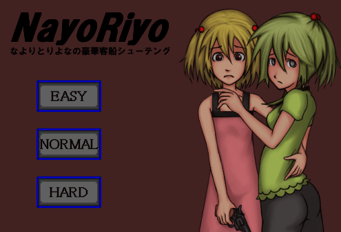
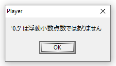
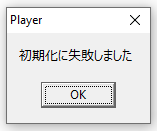
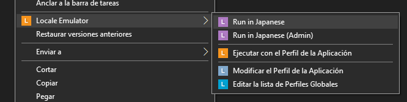

## NayoRiyo (FIXED FLOATS)

NayoRiyo is an indie Japanese action and shooting game originally released in 2013. The game features combat against various enemies, multiple endings, minigames, illustrations and additional content. It contains gore and ryona-themed content, including imagery depicting violence and injury.

### Float Compatibility Fix

Replaced problematic floating-point literals in the original .tonyu files with equivalent fractional values to fix compatibility errors in the game's older Tonyu runtime. For example, 0.5 was replaced with 1/2, 0.2 with 1/5...

Please make sure to run the game with your system locale set to Japanese or by using [Locale Emulator](https://github.com/xupefei/Locale-Emulator/).

I have packed a copy of Locale Emulator (v2.5.0.1) in the repository just in case the original one ever goes down in the future.

### Tested on

- Windows 10 Pro 22H2

### About the game

<strong>English</strong>

"NayoRiyo -Nayoriyo's Luxury Liner Shooting-"

CAUTION
This game contains intense grotesque scenes and sexual descriptions. We do not recommend playing if you dislike that kind of content or find it uncomfortable.
CAUTION

●Game Content●
"Nayori" and "Riyona" have ended up on a luxury liner belonging to "ONARY," a secret club of torture and murder enthusiasts. Finding a weapon cache by chance, they grab guns and stand up to ONARY's crew.
The original concept was an action game, but it somehow turned into a shooting game instead.

★Characters★
○Nayori Kago○
The younger twin sister. Cheerful, reliable, and well-liked by everyone. However, she shows a more spoiled side toward her older sister. Mentally fragile, in desperate situations her position and Riyona's may reverse. She is deeply devoted to her sister and has a strong will to follow through when it counts.

○Riyona Kago○
The older twin sister. Reserved but intelligent. Apparently quite scary when angry. Being blind, she always relies on her younger sister to accompany her. She is not completely blind and can detect the sun or strong light. In desperate situations, driven by the desire to protect her sister, she becomes slightly bolder. Deeply devoted to her sister, she would willingly sacrifice her own life for her.

▲System▲
A mouse-controlled shooting game.
Continuously shoot masked people coming from the left.
Game over if you get captured or if either character is incapacitated.
Depending on the number of defeated enemies or who captures you, special endings can occur.
When ammunition drops to 10 rounds or less for handguns, 3 rounds or less for shotguns (5 rounds on Easy only), or 0 for grenades, pressing the C key will make "Riyona" fetch ammo.
The ammo amount is random:
Handgun: 30, 20, 10, or 0 rounds.
Shotgun: 10, 5, or 0 rounds.
Grenade: 1 or 0.

■Controls■
Mouse: Move cursor or crosshairs
Z: Ready weapon / Advance conversation
Left Click: Shoot (when weapon is readied) / Advance conversation
S or Right Click: Change weapon
X: Reload (cannot be done while weapon is readied)
C: Supply ammo (when respective weapon is below standard count)
R: Return to title (*Can be done at any time, so be careful not to press by mistake)
T: Pinch
Space: Pause
Left/Right Arrows: Sometimes used for movement during events
Up/Down Arrows: Select choices

☆Weapon Types☆
Handgun
Small crosshair, hit detection only applies to the enemy's head. High ammo count.
Shotgun
Large crosshair, wide attack range. High lethality.
However, short range means it only hits if enemies are close (will not hit when the crosshair is a white dotted line).
Grenade
Area-of-effect attack. Effective when there are many enemies on screen. Outstanding lethality.
However, you can only hold one, and the probability of "Riyona" finding one is low.

◎Difficulty◎
Easy
Initial ammo: Handgun 30, Shotgun 10, Grenade 1.
Enemy speed: Slow.
Riyona finds ammo quickly + always gets the maximum replenishment.
Enemy spawn rate: Low.

Normal
Initial ammo: Handgun 20, Shotgun 5, Grenade 1.

Hard
Initial ammo: Handgun 20, Shotgun 5, Grenade 1.
Enemy speed: Fast.
"Riyona's" ammo-searching time is long.
High probability of not finding ammo at all.

▼Enemies▼
○Gentle○
Ordinary movement. Sometimes their speed increases.

○Metabo○
Takes two hits to defeat. Getting hit once makes him angry and increases his speed.

○Lady○
Brings a pet. Uses the pet as a shield.

○Mohican○
Throws axes from a distance. Can only be defeated with a handgun.

///////////////Update History///////////////
ver2.1
Bug fixes.
Bug details:
Enemies clipping through when Riyona's leg is injured
Gentle's special ending surroundings
Leaving message-only endings idle transitions them into special endings

ver2.0
Added enemies.
Added special endings.
Completed if no bugs.

ver1.20
Changed title screen.
Added enemies.
Added suicide mechanic.
Changed enemy death effects.
Added special endings.

ver1.12
Added grenades. Felt like giving up on the older sister aspect regarding this.
Shotgun added. Since it scatters, please do not point the muzzle at the sister.

ver1.11
Added title screen (difficulty settings available).

ver1.0
Changed enemy spawn balance.
Changed enemy hit detection. Must shoot the head to defeat.
Changed ammo replenishment method.
Added enemies.
Score 100+: Changed to Iron Ball END.

ver1.00
Cut corners since not much was made yet (no title screen).
Something happens at score 50+.
Sister currently does nothing. Please try not to shoot her.

~Monologue & Internal Info~
Walking graphics look weird, but don't worry about it.
Haven't tested the shooting part much, so balance is unknown.
Apologies for taking years to finish.
The art was mostly done, but writing text is so difficult that I got stuck, and time dragged on. Because of that, some newly added art might be from several years ago.
As time passed, I forgot how the program worked,
resulting in quite forced and messy source code, so please don't peek too deep inside.
If anyone experiences lag, I might fix it eventually.

Special END Unlock Conditions
Get caught by Gentle with a score of 70 or higher.
Get caught by Metabo with a score of 70 or higher.
Get caught by Lady with a score of 70 or higher.
Get caught by Gentle with a score of 150 or higher (Normal difficulty or higher).
Get caught by Metabo with a score of 150 or higher (Normal difficulty or higher).
Get caught by Lady with a score of 150 or higher (Normal difficulty or higher).
Perform OO on Riyona 10+ times, then get caught by Lady.
Defeat △△ 3+ times, then get caught by Gentle.
Perform □□.
Perform □□ with a score of 150 or higher.

○Bonus Game○
Nightmare Mode: Aim at the "Gun" on the title screen and shoot it 10 times.

Secret Spell
"Smash D on the title screen"

<strong>Japanese</strong>

「NayoRiyo-なよりとりよなの豪華客船シューティング-」

※要注意※
このゲームははげしく猟奇的シーン、性的描写が含まれております。その手のものが苦手な方や、不快感を感じる方はプレイしないことをおすすめします。
※要注意※

●ゲーム内容●
拷問、殺人愛好家たちの集まり秘密倶楽部ONARYの豪華客船に乗ってしまった「なより」と「りよな」。偶然見つけた武器庫で銃を手に入れ、ONARYの連中に立ち向かう。
もともとの原案はアクションゲームだったのだが、成り行きでシューティングゲームとなった。

★登場人物★
○篭野なより○
双子の妹。明るくしっかりものでみんなに慕われる性格。しかし姉には甘えん坊な一面を見せている。精神的には弱く、絶望的な状況化では、りよなと立場が逆転したりする。姉思いでやるときはやる強い意志を持っている。

○篭野りよな○
双子の姉。内気だが聡明。怒るとけっこう怖いらしい。盲目なため妹にはいつも付き添ってもらっている。全盲ではなく太陽や強い光を確認することはできる。絶望的な状況化では、自分が妹を守らなくてはという意思から、若干強気になる。妹思いで妹のためなら自分の命すら差し出す。

▲システム▲
マウスを使ったシューティングゲーム。
左からくる仮面を被った人たちをひたすら撃ちます。
捕まったりどちらかが行動不能になったらゲームオーバー。
倒した人数や捕まった時の人物などによって特殊エンドというものが発生する。
弾数がハンドガンの場合１０発以下、ショットガンの場合３発(イージーのみ５発)以下、手榴弾の場合０個になった時、
Ｃボタンで「りよな」が弾を取ってきてくれます。
弾数はランダムで
ハンドガン３０弾、２０弾、１０弾、０弾。
ショットガン１０弾、５弾、０弾。
手榴弾１個、０個。

■操作法■
マウス:カーソルや照準の移動
Ｚ:銃を構える・会話を進める
左クリック:撃つ（銃を構えている時)・会話を進める
Ｓor右クリック:武器変更
Ｘ:リロード(銃を構えてる時はできません)
Ｃ:弾補給(各武器規定弾数以下の時)
Ｒ:タイトルに戻る（※いつでもできるのでまちがえて押さないように）
Ｔ:つねる
スペース:ポーズ
←→:イベント時に移動としてつかうことも
↑↓:選択肢を選ぶ

☆武器の種類☆
　ハンドガン
照準が小さく、敵の頭のみしか当たり判定がない。弾数が多い。
　ショットガン
照準が大きく、攻撃範囲が広い。殺傷力も高い。
しかし射程距離が短いため敵が近くにいないと当たらない。(照準が白い点線の状態では当たらない)
　手榴弾
全体攻撃。画面内の敵が多い場合有効。殺傷力抜群。
しかし１個しか持てない上、「りよな」が見つけてくる確率が低い。

◎難易度◎
　イージー
初期弾数ハンドガン３０、ショットガン１０、手榴弾１。
敵のスピード遅め。
りよなの弾探しが早い＋いつも最大補充数獲得。
敵の出現確率が低め。

　ノーマル　
初期弾数ハンドガン２０、ショットガン５、手榴弾１。

　ハード
初期弾数ハンドガン２０、ショットガン５、手榴弾１。
敵のスピード速め。
「りよな」の弾探し時間が長い。
弾を見つけてこない確率が高い。

▼敵▼
○ジェントル○
平凡な動き。スピードが速かったりする時もある。

○メタボ○
２発当てなければ倒せない。一発当てると怒ってスピードが上がる。

○レディ○
ペット持参。ペットを盾に使ってくる。

○モヒカン○
遠距離から斧を投げてくる。ハンドガンでのみ倒せる。

///////////////更新履歴///////////////
ver2.1
バグ潰し。
以下バグ内容
・りよな足負傷時に敵がすり抜ける
・ジェントルの特殊エンド周り
・メッセージのみのエンドを放置すると特殊エンドに移行する

ver2.0
敵追加。
特殊エンド追加。
バグがなければ完成。

ver1.20
タイトル画面変更。
敵追加。
自害追加。
敵やられエフェクト変更。
特殊エンド追加。

ver1.12
手榴弾追加。これに関してはもういいやって感じで姉スルー。
ショットガン追加。散弾するので姉に銃口は向けないでください。

ver1.11
タイトル（難易度設定可能）追加。

ver1.10
敵出現のバランスを変更。
敵の当たり判定を変更。頭を撃たないと倒せない。
弾の補充法の変更。
敵追加。
スコア１００以上：鉄球ＥＮＤに変更。

ver1.00
まだいろいろ作ってないので手抜き。(タイトル画面なし)
とりあえずスコア５０以上でなんか起こります。
姉は現在なんもしない。どうか撃たないであげてください。

～ひとりごとと内部情報～
歩行グラフィックが変だけど気にしない気にしない。
シューティングパートはあんまりテストしてないのでバランスはわかりません。
完成まで何年もかかり申し訳なかったです。
絵とかはだいたい終わっていたのですが、文章を書くのが下手すぎて止まってしまい、
だらだらと時が経ってしまいました。なので今回追加した絵なども数年前の物だったりします。
時が立つにつれ、プログラムを忘れてしまい、
かなり強引で汚いソースになってしまったので中身はあんまりのぞかないでください。
挙動が重い人がいるようならもしかしたら直すかもしれません。

特殊END出現条件
・スコア70以上でジェントルに捕まる。
・スコア70以上でメタボに捕まる。
・スコア70以上でレディに捕まる。
・スコア150以上でジェントルに捕まる。(難易度ノーマル以上)
・スコア150以上でメタボに捕まる。(難易度ノーマル以上)
・スコア150以上でレディに捕まる。(難易度ノーマル以上)
・りよなに○○を10回以上行い、レディに捕まる。
・△△を３回以上倒して、ジェントルに捕まる。
・□□を行う。
・スコア150以上で□□を行う。

○オマケゲーム○
ナイトメアモード:タイトル画面で「銃」に照準を当てて１０回撃つ。

秘密の呪文
「タイトルでD連打」

